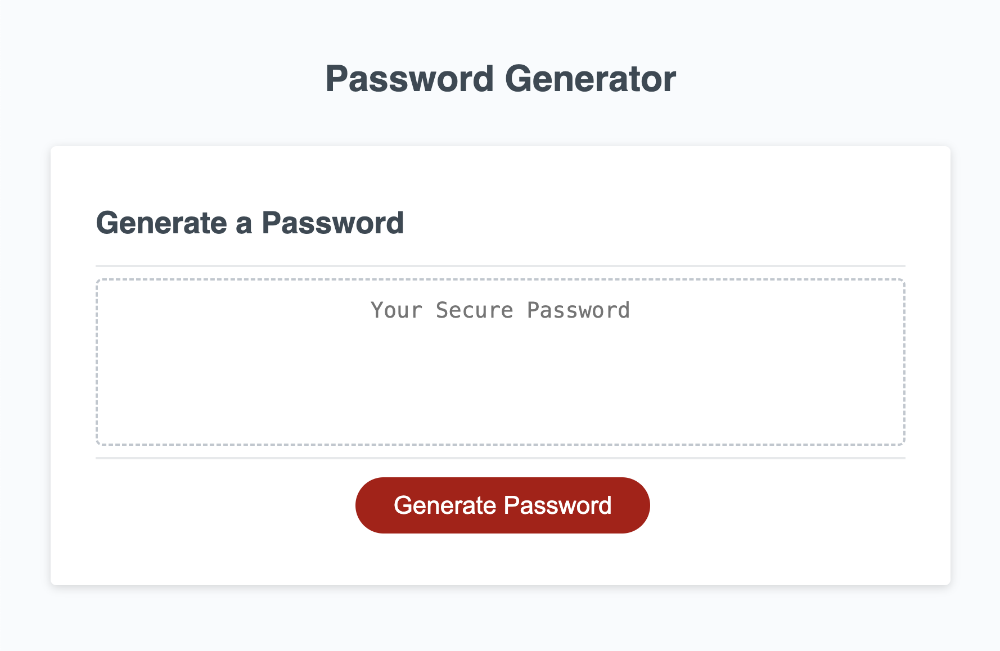
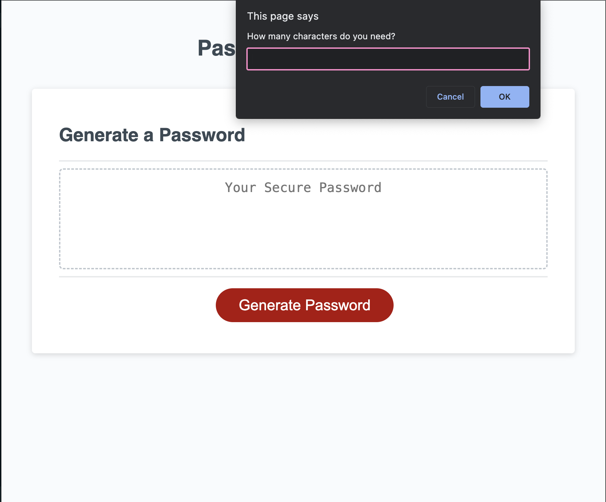

# Password Generator

https://nikitaaa95.github.io/Password-Generator

## Description

The purpose of this site is for the user to come to the site and build a non-predictive password
 meeting the criteria they need for any third party program they might be using. The site is 
 seeking to relieve the user from the work of creating that password.

I learned a lot more about Arrays and establishing strings, but I will be looking to 
learn more as there are things to improve with the site. The code works in theater and was working 
in my test with simpler values, but I can't figure out why it isn't working now.

## Usage

The user can click the "Generate Password" button. Then they will be prompted by a series of 
queries to define their password requirements. Once they've gone through the prompts, the 
site should provide them with a valid password.

## Credits

Please see the following sites that were used in my research for this project:
Array Set-up
https://javascript.plainenglish.io/create-an-array-of-alphabet-characters-in-javascript-with-this-simple-trick-930033079dd3

Trigger Prompt via Button click
https://www.shecodes.io/athena/11102-how-to-trigger-a-prompt-on-button-click-in-javascript#:~:text=addEventListener('click'%2C%20function,listens%20for%20the%20click%20event.

Limit Variable by Primative type
https://www.shecodes.io/athena/92427-how-to-check-if-a-value-is-a-number-in-javascript#:~:text=To%20check%20if%20a%20value%20is%20a%20number%2C%20you%20can,to%20the%20string%20'number'%20.&text=You%20can%20then%20call%20this,a%20number%2C%20and%20false%20otherwise.

Code generations
https://stackoverflow.com/questions/28440684/how-can-i-generate-a-string-of-numbers-and-letters-in-javascript

Merge Array Tutorial
https://dmitripavlutin.com/javascript-merge-arrays/

Random Shuffle in Array
https://www.tutorialspoint.com/How-to-randomize-shuffle-a-JavaScript-array

Length Prompt Information
https://www.shecodes.io/athena/54957-what-is-the-length-property-in-javascript

If with NO else
https://stackoverflow.com/questions/21528660/how-do-you-make-your-else-statement-do-nothing

Let Items
https://www.educative.io/answers/what-is-the-let-keyword-in-javascript

Variable Limits
https://discourse.gohugo.io/t/can-i-use-a-variable-initialized-in-an-if-statement-outside-of-it/39835

String from arrays
https://www.geeksforgeeks.org/javascript-program-for-generating-a-string-of-specific-length/#using-for-loop

Random Code generations
https://developer.mozilla.org/en-US/docs/Web/JavaScript/Reference/Global_Objects/String/padStart

Learning the JS Addition for Arrays
https://developer.mozilla.org/en-US/docs/Web/JavaScript/Reference/Operators/Addition_assignment